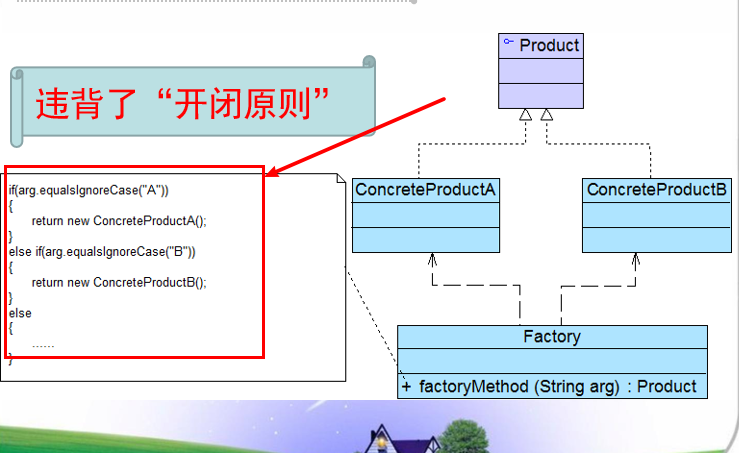
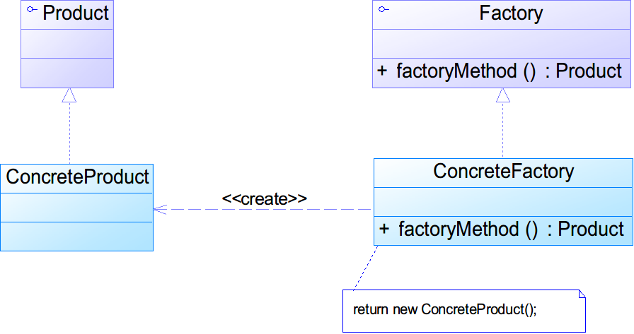
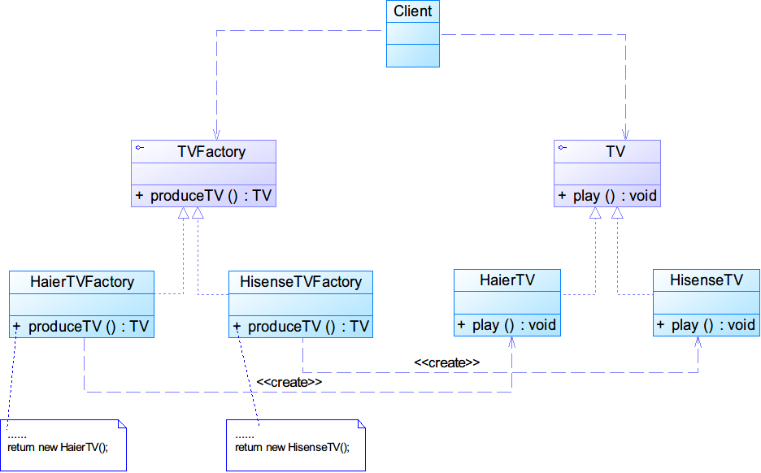
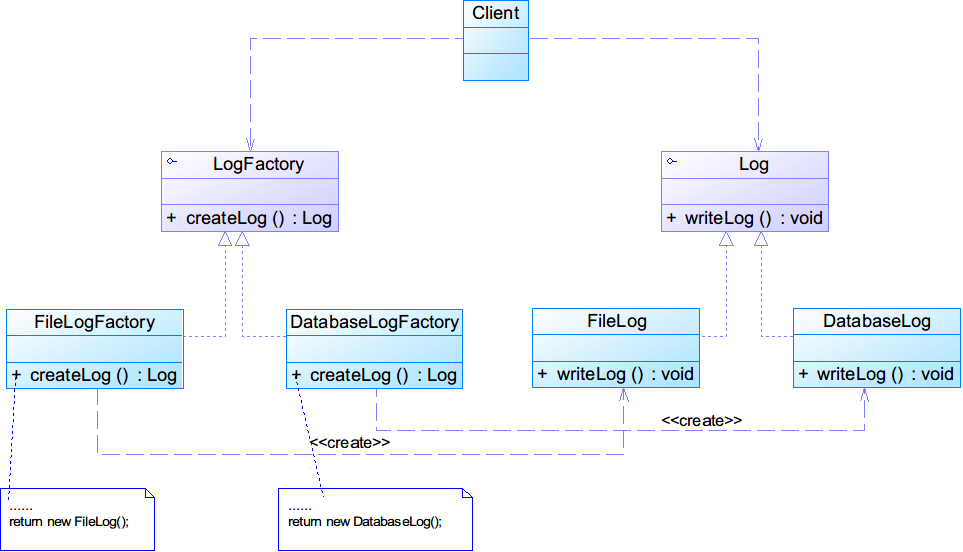

# 工厂方法模式
简单工厂虽然好，但是违反了开闭原则

在简单工厂工厂方法中需要写大量的if else

## 模式结构

## 分析
说白了这个模式就是所有的代码都对父类写，然后新建的时候选择对应哪一个子类。
因此符合了开闭原则。
但是：这种方法将导致系统中的类成对的出现。
## 例子

## 在以下情况下可以使用工厂方法模式
* 一个类不知道他所需要的对象的类（只需要知道工厂是什么就可以了）
* 一个类通过其子类来指定创建那个对象

